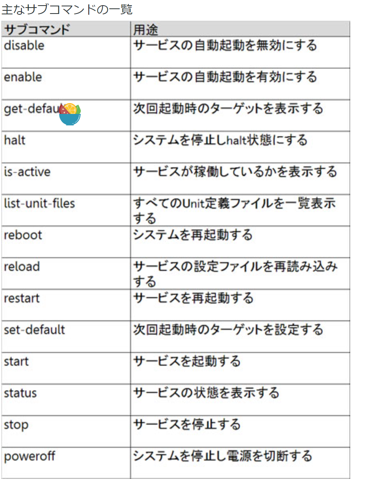
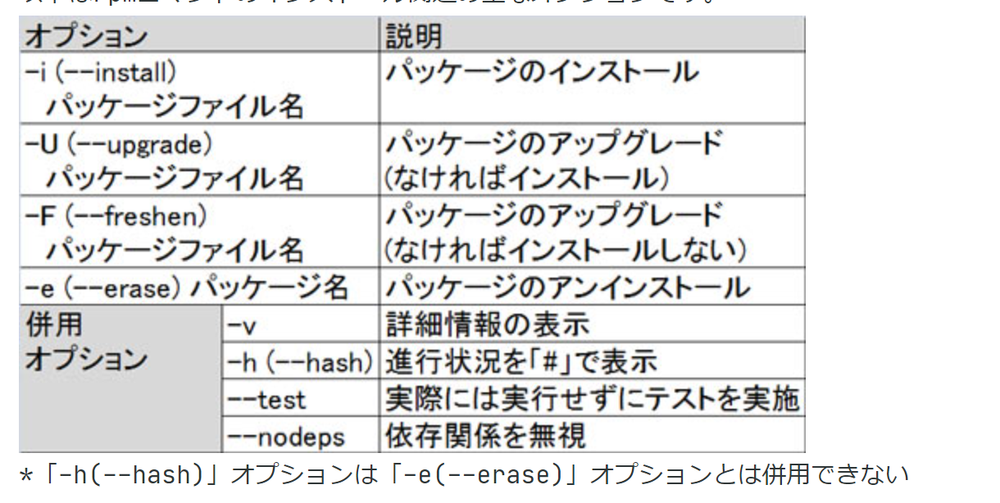
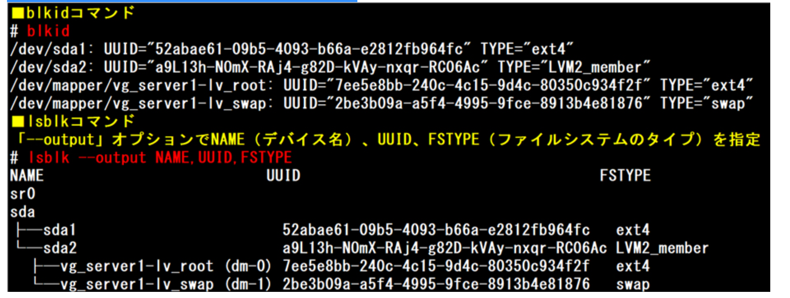

# level-101


## 代表的な環境変数


## メタキャラクタ

シェルによって特別に解釈される文字です。


## Kernal modules

`lsmod`

`cat /proc/modules`


## modprobeの設定ファイル

`/etc/modprobe.d/myconfig.conf`


## 共有ライブラリの場所 検索ファイル

プログラムの実行時に、共有ライブラリの場所を検索するために使用されるファイルは

`/etc/ld.so.cache`

です。

## Hash計算


## 実行中のジョブを一時停止

`Ctrl+Z`


## man

Linuxでは、コマンドや設定ファイルのためのオンラインマニュアルページ(manページ)が用意されています。オンラインマニュアルを参照するコマンドはmanです。

manコマンドの書式と主なオプションは以下のとおりです。


なお、同じキーワードにmanページが複数用意されている場合があります(例えばpasswdコマンドと「/etc/passwd」ファイル)。このような場合は、セクション番号を指定してmanコマンドを実行することで、目的のmanページを参照することが出来ます。セクション番号を指定しないで実行した場合は、セクション番号の小さいほうのマニュアルが表示されます。


## **systemctl**




## /etc/fstab

「/etc/fstab」ファイルは、利用するファイルシステムのマウント設定を事前に行っておく設定ファイルです。mountコマンドはこのファイルの設定内容を参照して動作します。

「/etc/fstab」ファイルの書式は以下の通りです。項目は6つです。
(1) デバイス名
(2) マウントポイント
(3) ファイルシステムの種類
(4) マウントオプション
(5) dumpフラグ
(6) fsckフラグ


## usb-info

接続されたUSBデバイスの情報を表示

```shell
lsusb

cat /proc/bus/usb/devices
```


## dpkg

dpkgはDebian形式のパッケージのインストール・アンインストールなど、基本的なパッケージ管理を行うコマンドです。


## rpm

以下はrpmコマンドのインストール関連の主なオプションです。




以下はrpmコマンドの参照・検査関連の主なオプション


## yum


## apt

パッケージの取得元(リポジトリ)を設定するファイルは

`/etc/apt/sources.list`


## chown

chown [-R] :グループ名 ファイルまたはディレクトリ

なお、「:」の部分は「.」としても同じです。


## chgrp

chgrp [-R] グループ名 ファイルまたはディレクトリ


## history

「!番号」と入力することで特定のコマンドを再実行できます


## vi/vim

### options

- -R  指定したファイルを読み取り専用で開きます


### ファイル編集commond


## service daemon


## ps


## paste

paste [-d 区切り文字] [ファイル名...]


## run level

### 参考


### 調べる

現在および1つ前のランレベルを調べることができるコマンドはrunlevelです。

したがって正解はrunlevelです。

```shell
# runlevel
N 5
```

先頭の文字は以前のランレベル、2つ目の文字は現在のランレベルを表しています。なお、「N」はランレベルの変更がされていないことを意味しています。

### 変更

・init
・telinit

例）ランレベルを5に変更する場合

\# init 5 
または
\# telinit 5

## grub


>  GRUBのバージョンが0.9x系のものを「GRUB Legacy」、1.9以降のものを「GRUB2」と呼びます。


### GRUB Legacy

GRUB Legacyの設定ファイルは「/boot/grub/menu.lst」、ディストリビューションによっては「/boot/grub/grub.conf」です。


### GRUB2

GRUB2の設定ファイルは「/boot/grub2/grub.cfg」です。しかし、「/boot/grub2/grub.cfg」ファイルを直接編集することはありません。設定内容は「/etc/default/grub」ファイルおよび「/etc/grub.d」ディレクトリ内のファイルに記述し、「grub2-mkconfig」コマンドで設定内容を「/boot/grub2/grub.cfg」ファイルに反映させます。

```
 grub2-mkconfig -o /etc/grub2.cfg
 
 /etc/grub2.cfg -> ../boot/grub2/grub.cfg
```


## Format Disk


### gdisk


### fdisk

fdiskはMBRのみに対応しています。


### mkswap

スワップ領域とは、物理メモリ（実メモリ）に収まらなかった情報を一時的に格納する為の、通常ハードディスク上に作成する領域です。


## XFS

XFSは、シリコングラフィックス社（SGI）が開発したジャーナリングファイルシステムです。


## fsck

fsckコマンドはファイルシステムのチェック、および問題を修復することが出来ます。


## mount


## /etc/fstab

「/etc/fstab」ファイルは、利用するファイルシステムのマウント設定を事前に行っておく設定ファイルです。mountコマンドはこのファイルの設定内容を参照して動作します。
一行一行がひとつのファイルシステムのマウント設定を表しています。


「/etc/fstab」ファイルの書式は以下の通りです。

(1) デバイス名
「/dev/sda1」のようにデバイスファイルを書くか、ラベル（あらかじめファイルシステムに対して付けておいた名前）やUUID（Universally Unique Identifier: 汎用一意識別子、全世界で重複が起きないように生成される一意な値）を使った指定を書きます。
ラベルを使う場合は 「LABEL=/boot」のように「LABEL=」の後ろにラベル名を書きます。この場合ラベル名は「/boot」です。
UUIDを使う場合も同様で「UUID=」の後ろに続けてUUID文字列を書きます。

デバイスのUUIDは、blkidコマンドやlsblkコマンドで確認できます。
blkidはブロックデバイス（HDDやCD-ROMなどのようにブロック単位でデータを転送するデバイス）の情報を表示するコマンドです。デバイス名や、UUID、ファイルシステムのタイプを表示できます。
lsblkはブロックデバイスをツリー状に一覧表示するコマンドです。「--output」オプションで表示項目を指定することによって、UUIDやファイルシステムのタイプを表示できます。

例）デバイス名、UUID、ファイルシステムのタイプを表示する



(2) マウントポイント
ルートファイルシステム上のどの位置にマウントするかの指定をルートからのパスで書きます。

(3) ファイルシステムの種類
デバイス名で指定したファイルシステムの種類を書きます。

(4) マウントオプション
マウントする際に必要となるオプションを書きます。


## grep


## kill

kill [-シグナル名または-シグナル番号] プロセスID
または
kill -s [シグナル名またはシグナル番号] プロセスID

killall [-シグナル名または-シグナル番号] プロセス名(コマンド名)
または
killall -s [シグナル名またはシグナル番号] プロセス名(コマンド名)

pkill [-シグナル名または-シグナル番号] プロセス名(コマンド名)
または
pkill --signal [-シグナル名または-シグナル番号] プロセス名(コマンド名)


## find

findは指定したディレクトリ以下からファイルやディレクトリを検索するコマンドです。


## tail

tailはファイルの末尾部分を指定して表示するコマンドです。


```
・tail -n 5 httpd.conf
・tail -5 httpd.conf
```


## tr


## **tune2fs** 

ファイルシステムをext2からext3に変換するにはtune2fsコマンドを利用します。


ext2ファイルシステムの「/dev/hda5」をext3に変換したい。

`tune2fs -j /dev/hda5`


## makewhatis

whatisデータベースとは、オンラインマニュアルページ(manページ)に関する情報を蓄積するデータベースのことです。
makewhatisコマンドを実行することで作成、または更新されます。


whatisデータベースは、「man -k キーワード」(apropos キーワード)コマンドや「man -f キーワード」(whatis キーワード)コマンドなどによって使用されます。

## nice


## sed


test.txt」ファイル内の全ての「a」を「A」に、また「b」を「B」に置換したい。

```shell
sed y/ab/AB/ test.txt
sed -e s/a/A/g -e s/b/B/g test.txt
```


## sort


## bz2


## uniq 


## xz 

bzip2よりも圧縮率が高い圧縮形式として、LZMA2圧縮アルゴリズムを採用したxzフォーマットがあります。xzはbzip2よりも多くのCPU／メモリを要求しますが、その分圧縮率が高く、また展開速度はbzip2より短いためファイル配布時の圧縮形式として採用されることが増えています。Linuxカーネルソースの配布形式としても採用されています。


